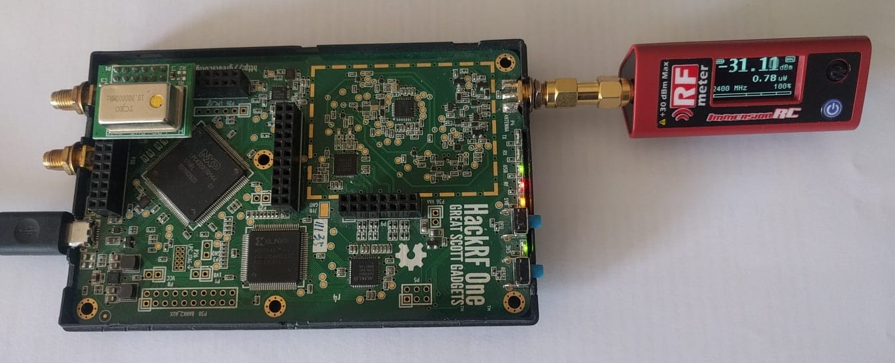

# Power-modulated Jammer
<p align="center">
     
     
     
     
</p>
We propose a new type of jammer, i.e., the <i>power-modulated jammer</i>. Our intuition is that a jammer that randomly changes its transmission power can make the localization process much harder (even impossible in some cases).

The details are provided in the paper (https://www.mdpi.com/1424-8220/22/2/646/htm).

## Software and Hardware Requirements
In order to setup the environment, you need to install the last version of GnuRadio and the module ```gr-osmosdr``` to work with the HackRF One.
```
sudo apt install python3
sudo apt install python3-pip
sudo -H pip install PyBOMBS
pybombs auto-config
pybombs recipes add gr-recipes git+https://github.com/gnuradio/gr-recipes.git
pybombs recipes add gr-etcetera git+https://github.com/gnuradio/gr-etcetera.git
pybombs install gnuradio
pybombs install gr-osmosdr
```

## Hardware Requirements
- A laptop equipped with GNU/Linux distro and GNURadio
- Great Scott Gadgets HackRF One: https://greatscottgadgets.com/hackrf/one/
- Antenna(s): ANT500, VERT900, VERT2450 (it depends by the frequency that you want to jam)
- Clock (optional): High Precision External TCXO Clock PPM0.1 for HackRF One

In order to measure the RF receiving power, you can buy the RF Power Meter v2 from https://www.immersionrc.com/fpv-products/rfpwrv2/ and connect it directly to the HackRF One.

## How to Run the Script
```python3 ./pmj.py```

## Experimental Testbed
<p align="center">
     
</p>

## Contributing
Pull requests are welcome. For major changes, please open an issue first to discuss what you would like to change.

## Disclaimer
Any actions and or activities related to the material contained within this github repository is solely your responsibility. The misuse of the information in this repository can result in criminal charges brought against the persons in question. The author(s) will not be held responsible in the event any criminal charges be brought against any individuals misusing the information in this repository to break the law.

## Authors
- Pietro Tedeschi (ptedeschi@hbku.edu.qa)

Division of Information and Computing Technology (ICT), College of Science and Engineering (CSE) - Hamad Bin Khalifa University (HBKU), Doha, Qatar

## License
`Power-modulated Jammer` is released under the GPL3-Clause <a href="LICENSE">license</a>.
